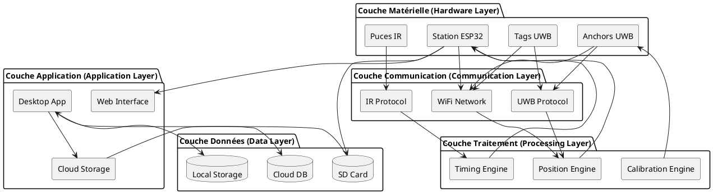
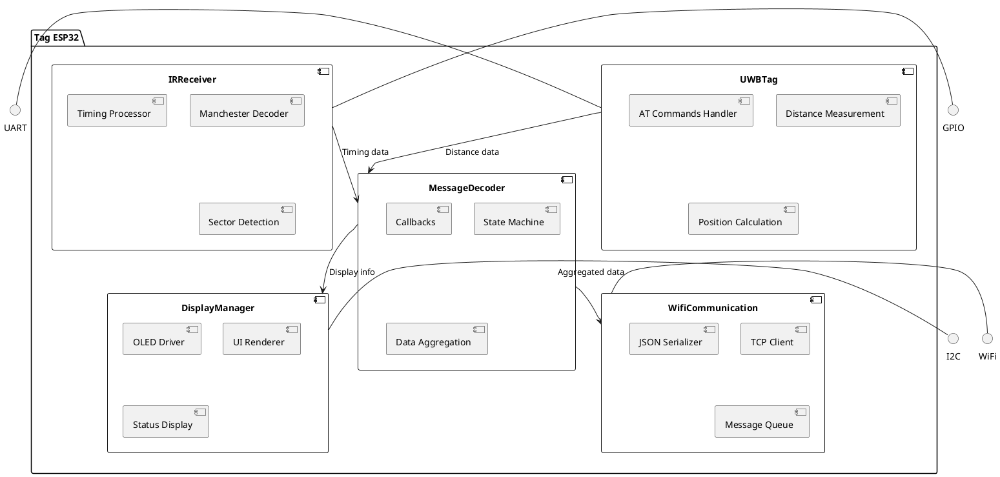
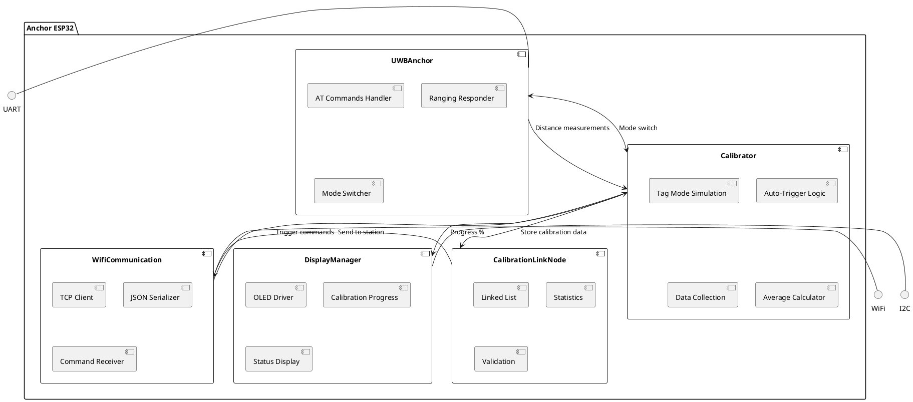
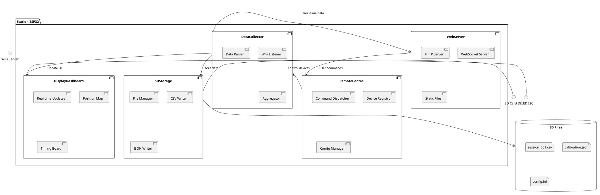
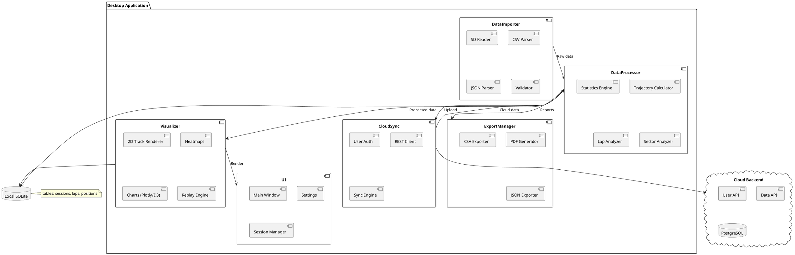
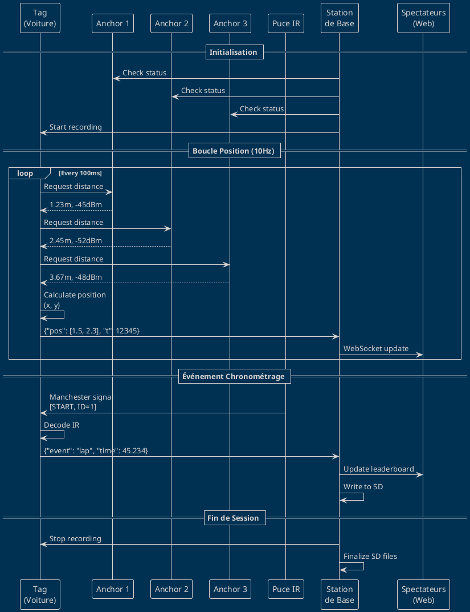
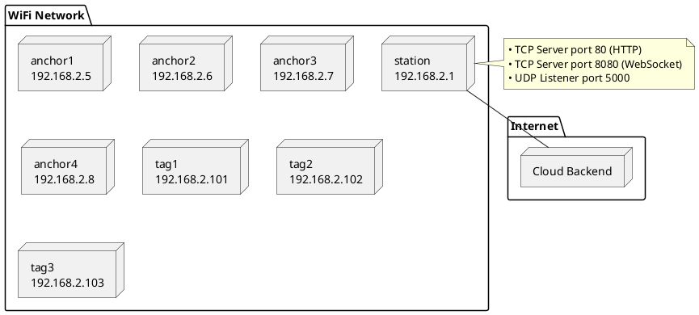
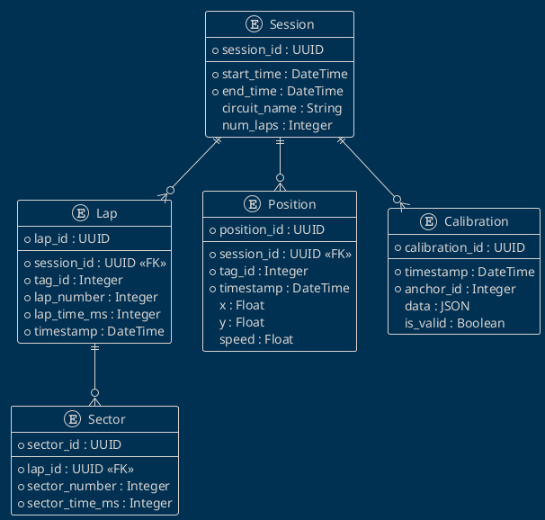
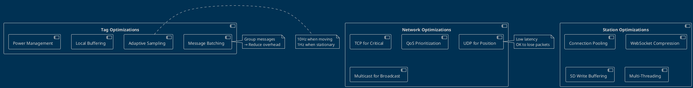
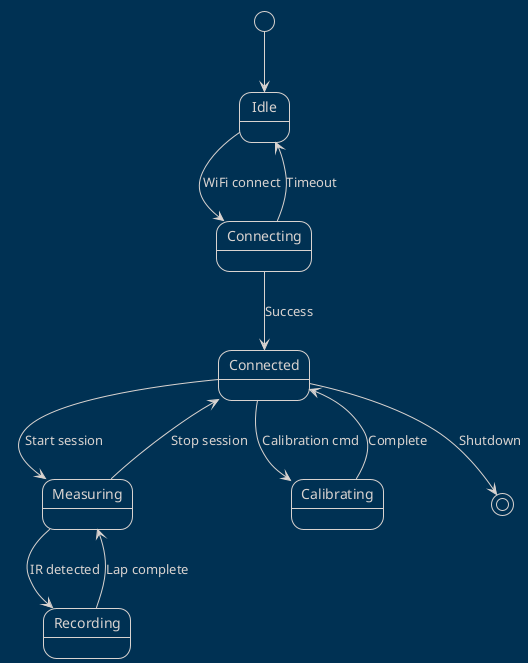

# Architecture Globale du Système

!!! abstract "Vue d'ensemble"
    Cette section présente l'architecture complète du système de positionnement UWB, de la vue 10,000 pieds jusqu'aux détails d'implémentation.

---

## 🏗️ Vue d'Ensemble de l'Architecture

Le système suit une **architecture distribuée en couches** avec séparation claire des responsabilités :



---

## 📦 Architecture en 4 Modules

### Module 1 : Tags UWB (Mobile)



**Responsabilités** :
- ✅ Mesurer distances vers tous les anchors visibles
- ✅ Calculer position 2D par trilatération
- ✅ Détecter signaux IR de chronométrage
- ✅ Agréger et transmettre données temps réel
- ✅ Afficher statut local

---

### Module 2 : Anchors UWB (Fixes)



**Responsabilités** :
- ✅ Répondre aux requêtes de distance des tags
- ✅ Auto-calibration en mesurant distances inter-anchors
- ✅ Switch automatique mode Anchor ↔ Tag
- ✅ Transmettre données calibration vers station
- ✅ Afficher progression calibration

---

### Module 3 : Station de Base



**Responsabilités** :
- 🚧 Interface web temps réel (HTML/JS)
- 🚧 Collecte données de tous les tags/anchors
- 🚧 Enregistrement sur carte SD
- 🚧 Télécommande des devices (start/stop, config)
- 🚧 Affichage live positions et classement

---

### Module 4 : Application Desktop



**Responsabilités** :
- 📋 Import fichiers depuis SD
- 📋 Traitement et analyse avancée
- 📋 Visualisations interactives (trajectoires, graphiques)
- 📋 Comparaisons multi-sessions
- 📋 Export rapports (PDF, CSV)
- 📋 Sync cloud par utilisateur

---

## 🔄 Flux de Données Complet

### Scénario : Course en Temps Réel



---

## 🌐 Architecture Réseau

### Topologie WiFi



**Adressage** :
- Station : `192.168.2.1` (serveur)
- Anchors : `192.168.2.5-8` (ID + 2)
- Tags : `192.168.2.101-108` (100 + ID)

---

## 💾 Architecture Données

### Modèle de Données



---

## ⚡ Architecture Performance

### Optimisations Clés



---

## 🧩 Patterns de Conception Utilisés

### 1. Observer Pattern (Callbacks)

```cpp
// MessageDecoder utilise observer pour notifier
class MessageDecoder {
public:
    void setRangeCallback(void (*callback)(JsonDocument*));
    void setSleepCallback(void (*callback)(int));
    void setWakeupCallback(void (*callback)(int));
};
```

### 2. State Machine Pattern



### 3. Factory Pattern (LinkNodes)

```cpp
// Création dynamique de nœuds selon type
AnchorLinkNode* createAnchorNode(uint8_t aid);
TagLinkNode* createTagNode(uint8_t tid);
CalibrationLinkNode* createCalibrationNode(uint8_t aid);
```

### 4. Singleton Pattern (Managers)

```cpp
class DisplayManager {
private:
    static DisplayManager* instance;
    DisplayManager() {}
    
public:
    static DisplayManager& getInstance();
};
```

---

## 🔧 Technologies & Stack

### Embedded Stack (Tags & Anchors)

| Layer | Technology |
|-------|------------|
| **Hardware** | ESP32-DevKit, DW3000 |
| **OS** | FreeRTOS (via Arduino) |
| **Language** | C++ (Arduino Framework) |
| **Build** | PlatformIO |
| **Communication** | WiFi (ESP32), UART (DW3000) |
| **Display** | Adafruit SSD1306 |
| **Data Format** | JSON (ArduinoJson) |

### Station Stack

| Layer | Technology |
|-------|------------|
| **Hardware** | ESP32-DevKit, SD Card Module |
| **Backend** | ESP32 AsyncWebServer |
| **Frontend** | HTML5, JavaScript, WebSocket |
| **Storage** | SD Card (FAT32) |
| **Visualization** | Chart.js / D3.js |

### Desktop Stack

| Layer | Technology (Options) |
|-------|----------------------|
| **Framework** | Electron / Qt / Python (Tkinter) |
| **Language** | JavaScript/TypeScript / C++ / Python |
| **Visualization** | Plotly / Matplotlib / D3.js |
| **Database** | SQLite |
| **Cloud** | REST API (Node.js / FastAPI) |

---

<div style="text-align: center; margin-top: 50px;">
  <p><strong>Architecture complète et modulaire pour garantir évolutivité et maintenabilité.</strong></p>
  <p><em>Prochain chapitre : <a href="../../protocols/uwb/">Protocoles de Communication</a></em></p>
</div>
