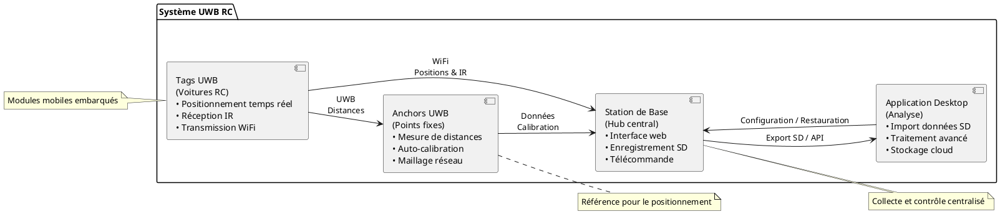
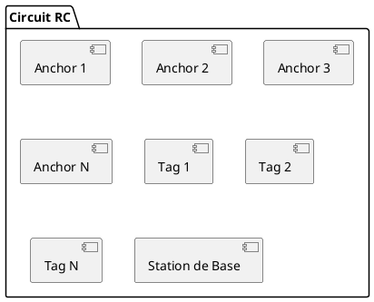
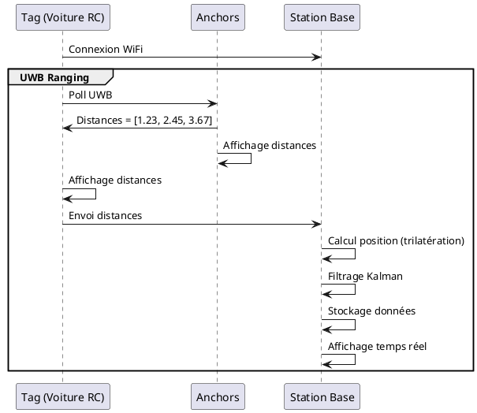
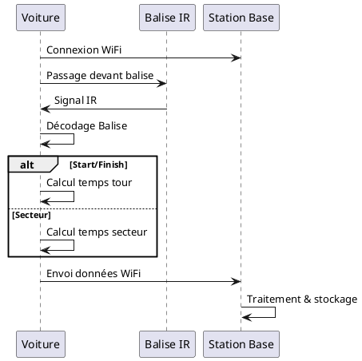
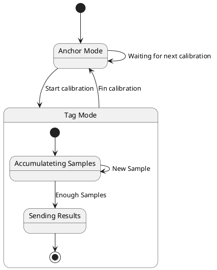

# Système de Positionnement UWB pour Voitures RC

<!-- 

  

 -->

## Bienvenue

Bienvenue dans la documentation du **Système de Positionnement UWB pour Voitures RC** ! 

Ce projet open-source permet de créer un système complet de chronométrage et de positionnement en temps réel pour des courses de voitures RC utilisant la technologie **Ultra-Wideband (UWB)** avec les modules **DW3000**.

---

---

## 📊 Diagramme d'Architecture Globale

---

## 🎬 Comment ça Fonctionne ?

### 1. Positionnement UWB

### 2. Chronométrage IR

### 3. Calibration Auto des Anchors

