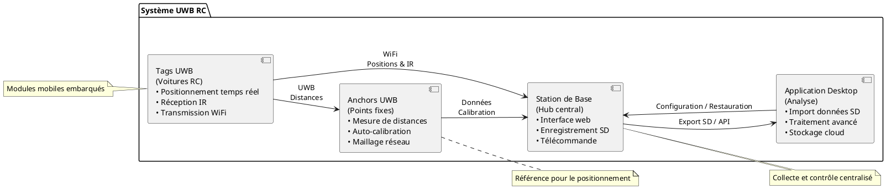
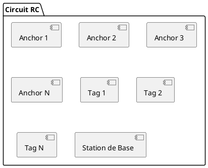
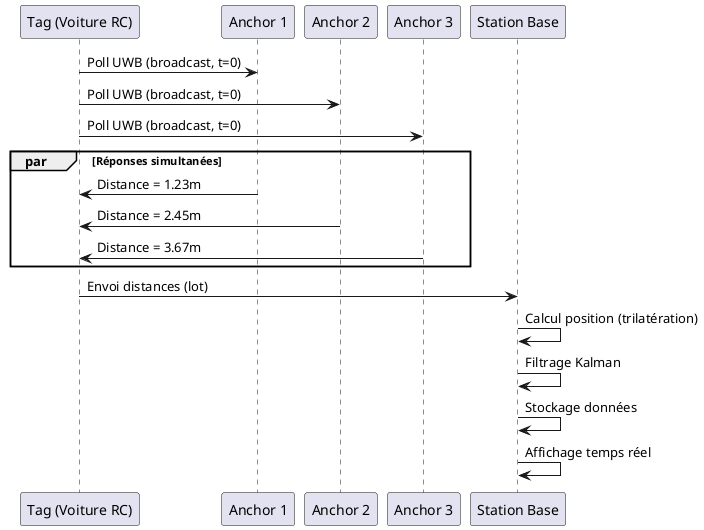
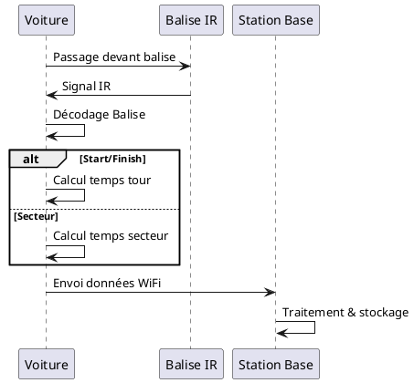
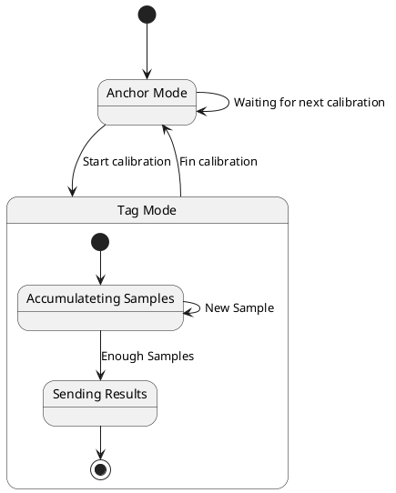

# Système de Positionnement UWB pour Voitures RC

<!-- 

  

 -->

!!! info "Version Actuelle"
    **Version** : 1.0.0  
    **Dernière mise à jour** : {{ git_revision_date_localized }}  
    **Statut** : 🟡 En développement actif

---

## 🎯 Bienvenue

Bienvenue dans la documentation du **Système de Positionnement UWB pour Voitures RC** ! 

Ce projet open-source permet de créer un système complet de chronométrage et de positionnement en temps réel pour des courses de voitures RC utilisant la technologie **Ultra-Wideband (UWB)** avec les modules **DW3000**.

---

## 🚀 Démarrage Rapide

=== "Utilisateur"
    Vous voulez juste utiliser le système ?
    
    1. 📥 [Installation du système](user-guide/installation.md)
    2. ⚙️ [Configuration initiale](user-guide/initial-setup.md)
    3. 🎮 [Utilisation quotidienne](user-guide/daily-usage.md)

=== "Développeur"
    Vous voulez contribuer ou modifier le code ?
    
    1. 💻 [Environnement de développement](dev-guide/environment.md)
    2. 🔨 [Build et flash](dev-guide/build-flash.md)
    3. 🐛 [Debugging](dev-guide/debugging.md)

=== "Chef de Projet"
    Vous gérez le projet ?
    
    1. 📋 [Vision et objectifs](project/vision.md)
    2. 🗓️ [Planification](project/planning.md)
    3. 🛣️ [Roadmap](project/roadmap.md)

---

---

## 📊 Diagramme d'Architecture Globale

---

## 🎬 Comment ça Fonctionne ?

### 1. Positionnement UWB

### 2. Chronométrage IR

### 3. Calibration Auto des Anchors

---

## 📈 Fonctionnalités Principales

### ✅ Implémenté

- [x] Positionnement UWB temps réel (précision < 30cm)
- [x] Chronométrage IR (précision < 10ms)
- [x] Calibration automatique des anchors
- [x] Transmission des données
- [x] Affichage OLED local
- [x] Gestion multi-tags (jusqu'à 8 voitures)

### 🚧 En Développement

- [ ] Station de base avec stockage SD
- [ ] Application desktop d'analyse
- [ ] Stockage cloud par utilisateur

### 🔮 Futur

- [ ] Support 3D (positionnement en hauteur)
- [ ] Machine learning pour prédiction trajectoire
- [ ] Mode multi-circuits
- [ ] API REST publique
- [ ] Application mobile (Android/iOS)

---

## 🛠️ Technologies Utilisées

### Hardware

| Composant | Modèle | Fonction |
|-----------|--------|----------|
| **Microcontrôleur** | ESP32-DevKit | Processing & WiFi |
| **Module UWB** | DW3000 | Mesure distances |
| **Écran** | SSD1306 OLED 128x64 | Affichage local |
| **Récepteur IR** | TSOP38238 | Chronométrage |
| **Alimentation** | LiPo 3.7V / 5V USB | Power |

### Software

| Technologie | Usage |
|-------------|-------|
| **PlatformIO** | Build system |
| **Arduino Framework** | Firmware base |
| **ArduinoJson** | Parsing messages |
| **Adafruit GFX** | Affichage OLED |
| **WiFi ESP32** | Communication réseau |
| **puml** | Diagrammes UML |
| **MkDocs Material** | Documentation |

---

## 📚 Navigation de la Documentation

!!! abstract "Vue d'ensemble"
    - [Introduction](overview/introduction.md)
    - [Architecture](overview/architecture.md)
    - [Spécifications](overview/specifications.md)
    - [Glossaire](overview/glossary.md)

!!! note "Gestion de Projet"
    - [Vision & Objectifs](project/vision.md)
    - [Planification](project/planning.md)
    - [Roadmap](project/roadmap.md)
    - [User Stories](project/user-stories.md)

!!! example "Composants"
    **Hardware**
    - [Tags](hardware/tag.md)
    - [Anchors](hardware/anchor.md)
    - [Puces IR](hardware/ir-beacons.md)
    - [Station](hardware/base-station.md)
    
    **Software**
    - [Firmware Tag](software/tag/architecture.md)
    - [Firmware Anchor](software/anchor/architecture.md)
    - [Station Base](software/base-station/architecture.md)
    - [App Desktop](software/desktop/architecture.md)

!!! tip "Guides"
    **Utilisateur**
    - [Installation](user-guide/installation.md)
    - [Configuration](user-guide/initial-setup.md)
    - [Utilisation](user-guide/daily-usage.md)
    - [Dépannage](user-guide/troubleshooting.md)
    
    **Développeur**
    - [Environnement](dev-guide/environment.md)
    - [Build & Flash](dev-guide/build-flash.md)
    - [Debugging](dev-guide/debugging.md)
    - [Tests](dev-guide/testing.md)

---

## 📞 Support & Contact

- 📧 Email : support@uwb-rc.com
- 💬 Discord : [Rejoindre le serveur](https://discord.gg/uwb-rc)
- 🐛 Issues : [GitHub Issues](https://github.com/hugo/UWB-ESP32/issues)
- 📖 Wiki : [GitHub Wiki](https://github.com/hugo/UWB-ESP32/wiki)
