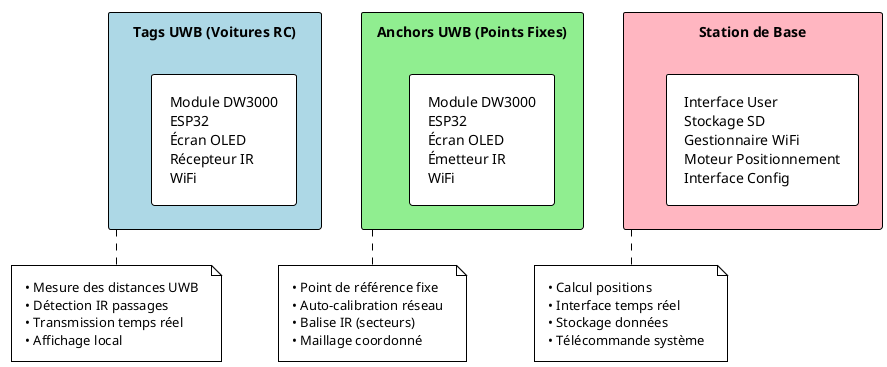
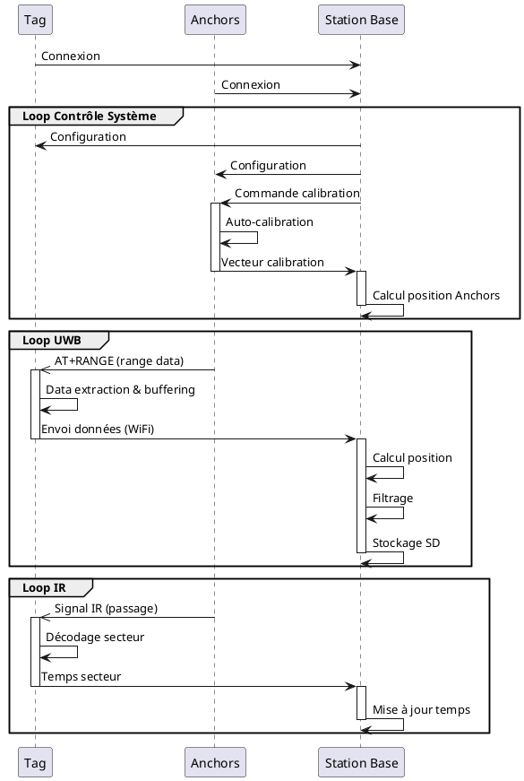
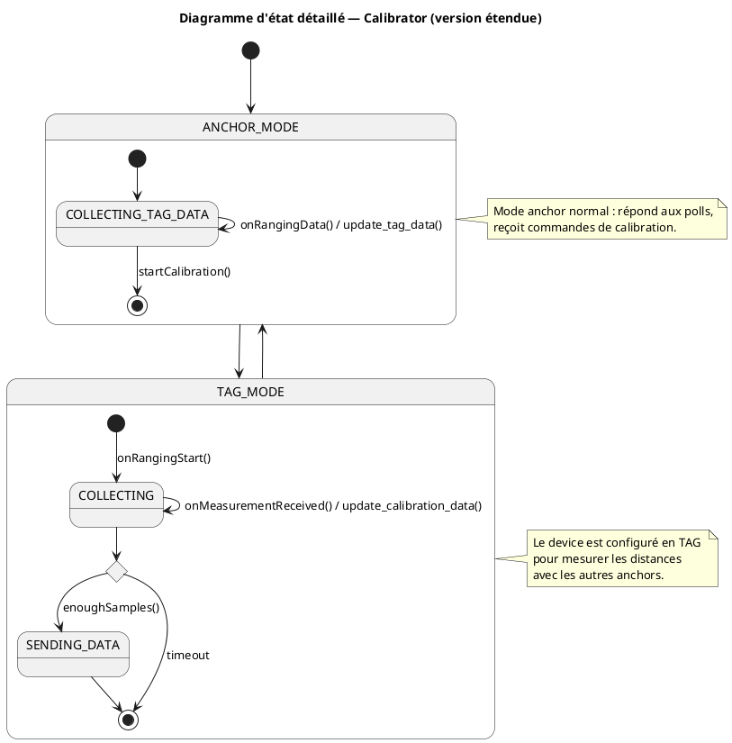
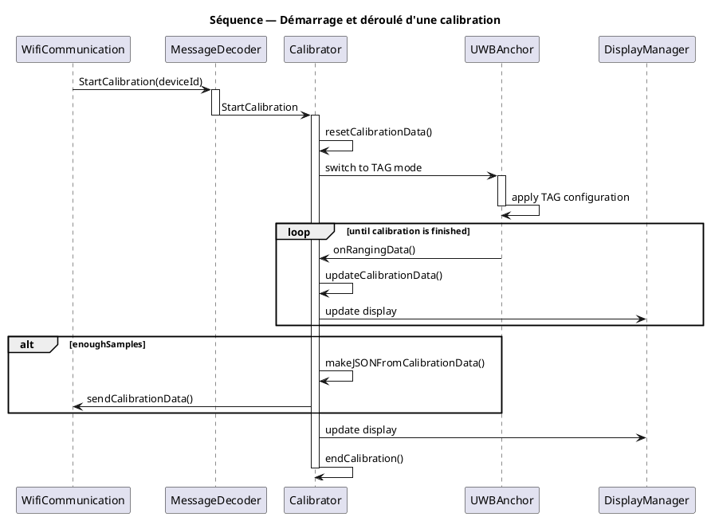

# Système de Positionnement UWB pour Voitures RC

Ce projet implémente un système complet de positionnement en temps réel et de chronométrage pour voitures RC, basé sur la technologie **Ultra-Wideband (UWB)** avec les modules **DW3000**.

## Architecture Système

Le système se compose de trois composants principaux qui travaillent en synergie :

## Tag UWB (Module Mobile)

Le Tag est le dispositif embarqué dans chaque voiture RC. Il assure le positionnement précis grâce aux mesures UWB avec les anchors, gère le chronométrage via la détection IR des passages, transmet les données en temps réel par WiFi et affiche les informations localement sur un écran OLED. Ce module compact intègre plusieurs composants matériels : un module DW3000 pour l'UWB, un ESP32 comme processeur principal avec WiFi intégré, un écran OLED SSD1306 pour l'affichage, un récepteur IR pour le chronométrage, le tout alimenté par une batterie embarquée.

## Anchor UWB (Point Fixe)
Les Anchors sont les points de référence fixes du système. Ils assurent plusieurs fonctionnalités essentielles : la mesure précise des distances avec les tags mobiles via UWB, l'auto-calibration automatique du réseau d'anchors, une communication WiFi bidirectionnelle avec la station de base, l'affichage de leur état sur un écran OLED intégré, et l'émission de signaux IR pour la détection des passages et secteurs. Au niveau matériel, les anchors utilisent les mêmes composants que les tags, à la différence qu'ils sont équipés d'un émetteur IR au lieu d'un récepteur.

## Station de Base

La station de base est le cerveau du système. Elle assure plusieurs fonctionnalités essentielles: le calcul précis des positions par trilatération, le traitement en temps réel des données provenant des tags et anchors, l'enregistrement complet des sessions sur carte SD, la télécommande centralisée de tous les composants du système, ainsi qu'une interface intuitive pour le contrôle et la visualisation.

## Flux de Communication

# Calibration des Anchors

La **calibration des anchors** vise à déterminer les positions relatives des différentes ancres (points fixes) du système, à partir des **distances mutuelles mesurées** par les modules UWB.  
Cette étape permet de construire un **repère cohérent**, dans lequel les positions ultérieures des *tags* pourront être exprimées.

## Digramme d'état 

## Diagramme de séquence

### La matrice de distances

Une fois les mesures de distances inter-anchors collectées, elles sont organisées dans une **matrice de distance** pour le traitement ultérieur :

$$
D =
\begin{bmatrix}
0 & d_{12} & d_{13} & \cdots & d_{1n} \\
d_{21} & 0 & d_{23} & \cdots & d_{2n} \\
d_{31} & d_{32} & 0 & \cdots & d_{3n} \\
\vdots & \vdots & \vdots & \ddots & \vdots \\
d_{n1} & d_{n2} & d_{n3} & \cdots & 0
\end{bmatrix}
$$

où $d_{ij}$ désigne la distance mesurée entre les anchors $i$ et $j$.  
En théorie, $D$ est symétrique ($d_{ij} = d_{ji}$), mais des écarts peuvent apparaître à cause du bruit de mesure ou d’erreurs de synchronisation.

## Reconstruction des positions

L’objectif est de retrouver les coordonnées $\mathbf{p}_i = (x_i, y_i)$ des $n$ anchors telles que :

$$
\|\mathbf{p}_i - \mathbf{p}_j\| \approx d_{ij}, \quad \forall (i, j)
$$

C’est un **problème de multidimensional scaling** (MDS) ou d’**ajustement géométrique par moindres carrés non linéaires**.

## Mise en place du repère

Pour lever l’ambiguïté liée aux rotations et translations, deux anchors sont fixées comme références :

- $A_0$ est placée à l’origine : $\mathbf{p}_0 = (0, 0)$  
- $A_1$ est placée sur l’axe des x : $\mathbf{p}_1 = (d_{01}, 0)$

Les autres anchors $A_k$ sont initialisées par **triangulation** à partir de ces deux références :

$$
\begin{cases}
x_k = \dfrac{d_{0k}^2 - d_{1k}^2 + d_{01}^2}{2d_{01}} \\
y_k = \sqrt{d_{0k}^2 - x_k^2}
\end{cases}
$$

Cette étape fournit une **estimation initiale** cohérente des positions.

## Optimisation par descente de gradient

Les positions initiales sont ensuite **optimisées numériquement** afin de minimiser l’erreur entre les distances mesurées et les distances géométriques reconstruites :

$$
E = \sum_{i<j} \left( \|\mathbf{p}_i - \mathbf{p}_j\| - d_{ij} \right)^2
$$

Une **descente de gradient** met à jour les positions à chaque itération selon :

$$
\mathbf{p}_i \leftarrow \mathbf{p}_i - \eta \, \nabla_{\mathbf{p}_i} E
$$

où $\eta$ est le taux d’apprentissage, et le gradient s’écrit :

$$
\nabla_{\mathbf{p}_i} E = 2 \sum_{j \ne i} \left( \|\mathbf{p}_i - \mathbf{p}_j\| - d_{ij} \right) \frac{\mathbf{p}_i - \mathbf{p}_j}{\|\mathbf{p}_i - \mathbf{p}_j\|}
$$

Pendant cette optimisation :
- L’anchor $A_0$ reste fixe (origine du repère),
- L’anchor $A_1$ reste sur l’axe des x (contrainte de rotation).

L’algorithme converge lorsque l’erreur moyenne devient stable ou inférieure à un seuil défini.

## Normalisation et échelle

Une fois les positions obtenues, elles peuvent être **normalisées** afin de tenir dans un cadre cohérent (utile pour l’affichage ou le traitement ultérieur).  
On calcule le **rectangle englobant** de toutes les positions, puis on met à l’échelle :

$$
\mathbf{p}_i^{(norm)} = \dfrac{\mathbf{p}_i - \mathbf{p}_{min}}{\max(\Delta x, \Delta y)}
$$

où $\Delta x$ et $\Delta y$ représentent les dimensions maximales du nuage de points.

## Évaluation de l’erreur relative

L’erreur finale est exprimée en **erreur quadratique moyenne relative** :

$$
\text{Erreur} = \frac{\sqrt{\dfrac{1}{N}\sum_{i<j} (\|\mathbf{p}_i - \mathbf{p}_j\| - d_{ij})^2}}{\bar{d}} \times 100
$$

avec $\bar{d}$ la distance moyenne entre anchors.  
Cette mesure reflète la cohérence géométrique du réseau d’anchors après calibration.
