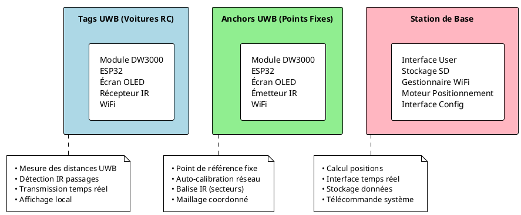

# Système de Positionnement UWB pour Voitures RC

Ce projet implémente un système complet de positionnement en temps réel et de chronométrage pour voitures RC, basé sur la technologie **Ultra-Wideband (UWB)** avec les modules **DW3000**.


## Architecture Système

Le système se compose de trois composants principaux qui travaillent en synergie :



## Tag UWB (Module Mobile)

Le Tag est le dispositif embarqué dans chaque voiture RC. Il assure le positionnement précis grâce aux mesures UWB avec les anchors, gère le chronométrage via la détection IR des passages, transmet les données en temps réel par WiFi et affiche les informations localement sur un écran OLED. Ce module compact intègre plusieurs composants matériels : un module DW3000 pour l'UWB, un ESP32 comme processeur principal avec WiFi intégré, un écran OLED SSD1306 pour l'affichage, un récepteur IR pour le chronométrage, le tout alimenté par une batterie embarquée.

## Anchor UWB (Point Fixe)
Les Anchors sont les points de référence fixes du système. Ils assurent plusieurs fonctionnalités essentielles : la mesure précise des distances avec les tags mobiles via UWB, l'auto-calibration automatique du réseau d'anchors, une communication WiFi bidirectionnelle avec la station de base, l'affichage de leur état sur un écran OLED intégré, et l'émission de signaux IR pour la détection des passages et secteurs. Au niveau matériel, les anchors utilisent les mêmes composants que les tags, à la différence qu'ils sont équipés d'un émetteur IR au lieu d'un récepteur.

## Station de Base

La station de base est le cerveau du système. Elle assure plusieurs fonctionnalités essentielles: le calcul précis des positions par trilatération, le traitement en temps réel des données provenant des tags et anchors, l'enregistrement complet des sessions sur carte SD, la télécommande centralisée de tous les composants du système, ainsi qu'une interface intuitive pour le contrôle et la visualisation.

## Flux de Communication

<!-- ```puml
@startuml
participant "Tag" as T
participant "Anchors" as A
participant "Station Base" as B

T -> B: Connexion
A -> B: Connexion

group Loop Contrôle Système
    B -> T: Configuration
    B -> A: Configuration
    B -> A: Commande calibration
    activate A
    A -> A: Auto-calibration
    A -> B: Vecteur calibration
    deactivate A
end

group Loop UWB
    A ->> T: AT+RANGE (range data)
    activate T
    T -> T: Data extraction & buffering
    T -> B: Envoi données (WiFi)
    deactivate T
    activate B
    B -> B: Calcul position
    B -> B: Filtrage
    B -> B: Stockage SD
    deactivate B
end

group Loop IR
    A ->> T: Signal IR (passage)
    activate T
    T -> T: Décodage secteur
    T -> B: Temps secteur
    deactivate T
    activate B
    B -> B: Mise à jour temps
    deactivate B
end
@enduml
``` -->

## Calibration des Anchors

La calibration des anchors est une étape cruciale pour assurer la précision du système de positionnement. Elle utilise des mesures UWB pour déterminer les distances relatives entre les anchors fixes. On obtient ainsi une matrice de calibration qui est ensuite utilisée pour créer un repère. Les positions des tags sont alors calculées par rapport à ce repère calibré.


<!-- Explication détaillée de comment on obtient depuis la matrice de calibration le repère -->

### La matrice de calibration

$$\begin{bmatrix}
0 & d_{12} & d_{13} & \cdots & d_{1n} \\
d_{21} & 0 & d_{23} & \cdots & d_{2n} \\
d_{31} & d_{32} & 0 & \cdots & d_{3n} \\
\vdots & \vdots & \vdots & \ddots & \vdots \\
d_{n1} & d_{n2} & d_{n3} & \cdots & 0
\end{bmatrix}$$

La matrice ci-dessus représente les distances mesurées entre chaque paire d'anchors. Chaque élément $d_{ij}$ correspond à la distance entre l'anchor $i$ et l'anchor $j$. Cette matrice est symétrique ($d_{ij} = d_{ji}$), avec des zéros sur la diagonale principale, car la distance entre une anchor et elle-même est nulle.
