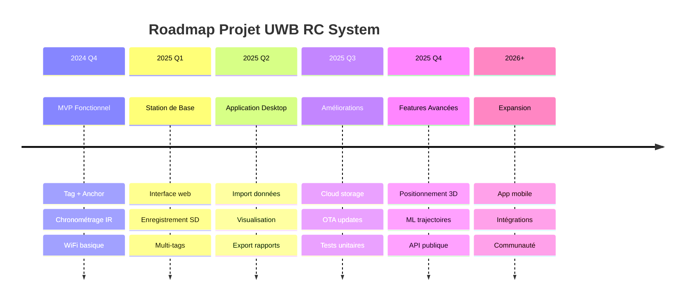
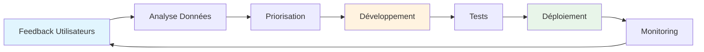

# Vision et Objectifs du Projet

!!! quote "Vision"
    Créer un système de chronométrage et de positionnement **précis, fiable et accessible** pour les courses de voitures RC, permettant une analyse détaillée des performances en temps réel.

---

## 🎯 Objectifs Principaux

### 1. Positionnement Précis en Temps Réel

**Objectif** : Localiser chaque voiture RC avec une précision < 30cm à 10Hz

**Bénéfices** :
- Visualisation en direct des trajectoires
- Analyse des lignes de course optimales
- Détection de zones à problème
- Comparaison entre pilotes

**Critères de Succès** :
- ✅ Précision < 30cm en conditions réelles
- ✅ Taux de rafraîchissement ≥ 10Hz
- ✅ Support simultané de 8 voitures minimum
- ✅ Latence totale < 100ms

---

### 2. Chronométrage Ultra-Précis

**Objectif** : Chronométrer tours et secteurs avec précision < 10ms

**Bénéfices** :
- Temps au tour officiels
- Temps secteurs pour analyse fine
- Classement en temps réel
- Détection photo-finish

**Critères de Succès** :
- ✅ Précision IR < 10ms
- ✅ Aucune perte de signal en passage
- ✅ Décodage Manchester fiable
- ✅ Distinction Start/Finish et secteurs

---

### 3. Système Auto-Calibré

**Objectif** : Configuration automatique sans intervention manuelle

**Bénéfices** :
- Installation rapide sur nouveau circuit
- Pas besoin de mesures manuelles
- Recalibration automatique si nécessaire
- Réduction erreurs humaines

**Critères de Succès** :
- ✅ Calibration complète en < 2 minutes
- ✅ Précision inter-anchor < 5cm
- ✅ Persistance données calibration
- ✅ Détection automatique topologie réseau

---

### 4. Analyse Post-Course Approfondie

**Objectif** : Fournir outils d'analyse détaillée des performances

**Bénéfices** :
- Amélioration technique des pilotes
- Comparaison sessions multiples
- Statistiques avancées
- Export données personnalisé

**Critères de Succès** :
- ✅ Stockage 100% des données brutes
- ✅ Import depuis carte SD
- ✅ Visualisations interactives
- ✅ Export CSV/JSON/PDF

---

## 🌟 Valeurs du Projet

### Accessibilité

!!! tip "Open Source"
    - Code entièrement open-source
    - Documentation complète et pédagogique
    - Composants abordables (< 50€ par tag)
    - DIY-friendly

### Fiabilité

!!! success "Robustesse"
    - Tests exhaustifs en conditions réelles
    - Mode dégradé si composants défaillants
    - Redondance des données
    - Recovery automatique après erreurs

### Extensibilité

!!! note "Modularité"
    - Architecture modulaire
    - APIs bien définies
    - Support nouveaux capteurs
    - Intégration facile avec autres systèmes

### Performance

!!! warning "Optimisation"
    - Temps réel garanti
    - Faible latence réseau
    - Minimisation consommation batterie
    - Scalabilité (jusqu'à 16 tags)

## 🗺️ Roadmap Vision Long Terme

---

## 🚀 Phases du Projet

### Phase 1 : MVP (Minimum Viable Product) ✅

**Objectif** : Prouver le concept avec fonctionnalités de base

**Livrables** :
- [x] Tag UWB fonctionnel
- [x] Anchor UWB avec calibration
- [x] Réception IR chronométrage
- [x] Communication WiFi basique
- [x] Affichage OLED

**Statut** : ✅ **COMPLÉTÉ**

---

### Phase 2 : Station de Base 🔄

**Objectif** : Hub central pour collecte et contrôle

**Livrables** :
- [ ] ESP32 serveur web
- [ ] Interface temps réel
- [ ] Enregistrement SD
- [ ] Télécommande tags/anchors
- [ ] Gestion multi-utilisateurs

**Statut** : 🟡 **EN COURS**

---

### Phase 3 : Application Desktop 📋

**Objectif** : Outils d'analyse post-course

**Livrables** :
- [ ] Application Electron/Qt
- [ ] Import données SD
- [ ] Graphiques interactifs
- [ ] Comparaisons multiples
- [ ] Export rapports

**Statut** : 📋 **PLANIFIÉ**

---

### Phase 4 : Cloud & Mobile 🔮

**Objectif** : Écosystème complet connecté

**Livrables** :
- [ ] Backend cloud (Node.js/Python)
- [ ] API REST publique
- [ ] App mobile (React Native)
- [ ] Synchronisation multi-devices
- [ ] Communauté en ligne

**Statut** : 🔮 **FUTUR**

---

## 💡 Principes de Conception

### 1. Fail-Safe

!!! danger "Sécurité Avant Tout"
    - Aucune perte de données en cas de coupure
    - Mode dégradé si composant défaillant
    - Watchdog timers sur tous les devices
    - Validation des données critiques

### 2. User-Centric

!!! info "Centré Utilisateur"
    - Interface intuitive (pas de manuel nécessaire)
    - Feedback immédiat des actions
    - Messages d'erreur clairs et actionnables
    - Workflow optimisé pour cas d'usage réels

### 3. Data-Driven

!!! note "Décisions Basées sur Données"
    - Logging exhaustif pour debug
    - Métriques performance collectées
    - Tests A/B pour UX
    - Feedback utilisateurs analysé

### 4. Scalable

!!! tip "Évolutivité"
    - Support 8 → 16 → 32 tags sans refonte
    - Architecture micro-services
    - APIs versionnées
    - Backward compatibility garantie

---

## 🎓 Apprentissages Clés

### Leçons du Développement

!!! success "Ce qui fonctionne bien"
    - Architecture modulaire avec LinkNodes
    - Calibration automatique anchors
    - Format JSON pour messages
    - PlatformIO pour multi-projets

!!! warning "Défis rencontrés"
    - Interférences WiFi sur circuit
    - Gestion mémoire limitée ESP32
    - Synchronisation temporelle
    - Switch mode Anchor/Tag délicat

!!! failure "Erreurs à éviter"
    - Code temporaire non nettoyé
    - Valeurs hardcodées (magic numbers)
    - Pas assez de logs pour debug
    - Manque tests unitaires

---

## 📞 Parties Prenantes

| Rôle | Nom | Responsabilité | Contact |
|------|-----|----------------|---------|
| **Product Owner** | Hugo | Vision produit, priorités | hugo@email.com |
| **Tech Lead** | TBD | Architecture, code reviews | - |
| **UX Designer** | TBD | Interface, expérience utilisateur | - |
| **Beta Testers** | Club RC Local | Tests terrain, feedback | - |
| **Communauté** | Open-Source | Contributions, support | GitHub |

---

## 🔄 Processus d'Amélioration Continue

### Cycle de Release

- **Sprints** : 2 semaines
- **Releases Minor** : Mensuelle
- **Releases Major** : Trimestrielle
- **Hotfixes** : Dès que nécessaire

---

  
<strong>Cette vision guide toutes nos décisions techniques et fonctionnelles.</strong>

  
<em>Prochain chapitre : <a href="../planning/">Planification Détaillée</a></em>

