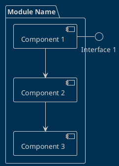
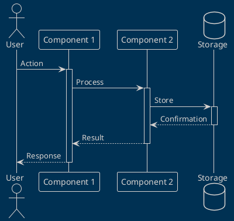
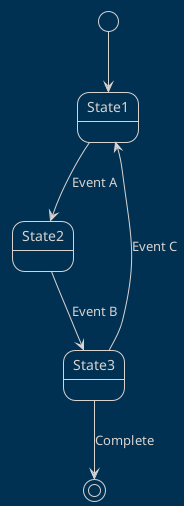

# Template de Documentation - [NOM DU MODULE]

!!! info "Statut"
    **Version** : X.X.X  
    **Statut** : <span class="status-badge status-progress">🔄 En développement</span>  
    **Priorité** : <span class="priority-high">HAUTE</span>  
    **Responsable** : [Nom]

---

## 📋 Vue d'Ensemble

### Description Générale

[Description claire et concise du module en 2-3 phrases]

### Objectifs

- 🎯 **Objectif 1** : Description
- 🎯 **Objectif 2** : Description
- 🎯 **Objectif 3** : Description

### Cas d'Usage Principaux

1. **Cas 1** : Description du scénario
2. **Cas 2** : Description du scénario
3. **Cas 3** : Description du scénario

---

## 🏗️ Architecture

### Diagramme de Composants



### Composants Détaillés

#### Composant 1

**Responsabilités** :
- Action 1
- Action 2

**Dépendances** :
- Dépendance A
- Dépendance B

**API** :
```cpp
class Component1 {
public:
    void initialize();
    void process();
    DataType getData();
};
```

---

## 🔄 Flux de Fonctionnement

### Diagramme de Séquence



### Étapes Détaillées

1. **Initialisation**
   - Description de l'étape
   - Code exemple si nécessaire

2. **Traitement Principal**
   - Description de l'étape
   - Code exemple si nécessaire

3. **Finalisation**
   - Description de l'étape
   - Code exemple si nécessaire

---

## 📊 Diagrammes d'État



---

## 💻 Implémentation

### Structure de Fichiers

```
module-name/
├── include/
│   ├── ModuleName.h
│   └── Components/
│       ├── Component1.h
│       └── Component2.h
├── src/
│   ├── ModuleName.cpp
│   └── Components/
│       ├── Component1.cpp
│       └── Component2.cpp
└── test/
    ├── test_component1.cpp
    └── test_component2.cpp
```

### Classes Principales

#### Classe ModuleName

```cpp
/**
 * @brief Description de la classe
 * 
 * Description détaillée du rôle et fonctionnement
 */
class ModuleName {
private:
    // Attributs privés
    int attribute1;
    bool attribute2;
    
public:
    /**
     * @brief Constructeur
     */
    ModuleName();
    
    /**
     * @brief Initialiser le module
     * @return true si succès, false sinon
     */
    bool initialize();
    
    /**
     * @brief Traiter les données
     * @param data Données en entrée
     * @return Résultat du traitement
     */
    ResultType process(const DataType& data);
    
    /**
     * @brief Obtenir l'état actuel
     * @return État du module
     */
    StateType getState();
};
```

### Exemples de Code

#### Exemple 1 : Initialisation

```cpp
// Créer instance
ModuleName module;

// Initialiser
if (!module.initialize()) {
    Serial.println("Erreur initialisation");
    return;
}

Serial.println("Module prêt");
```

#### Exemple 2 : Utilisation

```cpp
// Préparer données
DataType data = prepareData();

// Traiter
ResultType result = module.process(data);

// Vérifier résultat
if (result.isValid()) {
    Serial.print("Résultat : ");
    Serial.println(result.getValue());
}
```

---

## 🔌 API & Interfaces

### API Publique

#### Fonctions Principales

| Fonction | Paramètres | Retour | Description |
|----------|------------|--------|-------------|
| `initialize()` | Aucun | `bool` | Initialise le module |
| `process(data)` | `DataType` | `ResultType` | Traite les données |
| `getState()` | Aucun | `StateType` | Retourne l'état |

#### Callbacks

```cpp
// Définir callback
typedef void (*DataCallback)(const DataType& data);

// Enregistrer callback
module.setDataCallback([](const DataType& data) {
    // Traitement callback
});
```

### Format des Messages

#### Message Entrée

```json
{
  "type": "request",
  "action": "process",
  "data": {
    "field1": "value1",
    "field2": 123
  },
  "timestamp": 1698765432
}
```

#### Message Sortie

```json
{
  "type": "response",
  "status": "success",
  "result": {
    "field1": "result1",
    "field2": 456
  },
  "timestamp": 1698765433
}
```

---

## ⚙️ Configuration

### Paramètres

| Paramètre | Type | Défaut | Description |
|-----------|------|--------|-------------|
| `PARAM_1` | `int` | 100 | Description paramètre 1 |
| `PARAM_2` | `bool` | true | Description paramètre 2 |
| `PARAM_3` | `float` | 1.5 | Description paramètre 3 |

### Fichier de Configuration

```ini
# Configuration Module

[general]
enabled = true
debug_mode = false

[parameters]
param1 = 100
param2 = true
param3 = 1.5

[network]
timeout_ms = 5000
retry_count = 3
```

---

## 📈 Performance

### Métriques

| Métrique | Valeur Cible | Valeur Actuelle | Status |
|----------|--------------|-----------------|--------|
| Latence | < 50ms | 35ms | ✅ OK |
| Throughput | > 100 msg/s | 120 msg/s | ✅ OK |
| Mémoire | < 10KB | 8KB | ✅ OK |
| CPU | < 20% | 15% | ✅ OK |

### Optimisations

!!! tip "Optimisation 1"
    Description de l'optimisation et son impact

!!! tip "Optimisation 2"
    Description de l'optimisation et son impact

---

## 🧪 Tests

### Tests Unitaires

```cpp
// test_module.cpp

TEST_CASE("Initialization", "[module]") {
    ModuleName module;
    REQUIRE(module.initialize() == true);
}

TEST_CASE("Processing", "[module]") {
    ModuleName module;
    module.initialize();
    
    DataType data = createTestData();
    ResultType result = module.process(data);
    
    REQUIRE(result.isValid() == true);
    REQUIRE(result.getValue() == EXPECTED_VALUE);
}
```

### Tests d'Intégration

```cpp
TEST_CASE("Integration with Component2", "[integration]") {
    ModuleName module;
    Component2 component;
    
    module.initialize();
    component.initialize();
    
    // Test interaction
    // ...
}
```

### Scénarios de Test

| ID | Scénario | Entrée | Sortie Attendue | Status |
|----|----------|--------|-----------------|--------|
| T1 | Init normale | - | Success | ✅ Pass |
| T2 | Process valide | Valid data | Valid result | ✅ Pass |
| T3 | Process invalide | Invalid data | Error | ✅ Pass |
| T4 | Stress test | 1000 msg/s | No crash | 🟡 Pending |

---

## 🐛 Dépannage

### Problèmes Communs

#### Erreur : "Module not initialized"

**Symptômes** :
- Message d'erreur au démarrage
- Fonctionnalités non disponibles

**Causes Possibles** :
- Oubli d'appeler `initialize()`
- Dépendances non satisfaites

**Solution** :
```cpp
// Vérifier initialisation
if (!module.initialize()) {
    Serial.println("Vérifier dépendances");
    // Traiter erreur
}
```

#### Erreur : "Processing failed"

**Symptômes** :
- Résultats incorrects
- Exceptions lancées

**Causes Possibles** :
- Données invalides
- État incorrect

**Solution** :
```cpp
// Valider données avant traitement
if (!data.isValid()) {
    Serial.println("Données invalides");
    return;
}
```

---

## 📚 Références

### Documentation Externe

- [Lien documentation 1](https://example.com)
- [Lien documentation 2](https://example.com)

### Articles & Ressources

- Article 1 : Titre et lien
- Article 2 : Titre et lien

---

## 📝 Notes de Version

### Version 1.1.0 (2025-03-01)

✨ **Nouvelles Fonctionnalités**
- Feature A ajoutée
- Feature B ajoutée

🐛 **Corrections**
- Bug X corrigé
- Bug Y corrigé

⚡ **Améliorations**
- Performance +20%
- Mémoire -15%

### Version 1.0.0 (2025-01-01)

🎉 **Version Initiale**
- Fonctionnalités de base implémentées

---

## ✅ Checklist Implémentation

- [ ] Architecture définie
- [ ] Classes principales codées
- [ ] Tests unitaires écrits
- [ ] Tests d'intégration passés
- [ ] Documentation API complète
- [ ] Exemples de code fournis
- [ ] Performance validée
- [ ] Revue de code effectuée
- [ ] Déploiement en production

---

<div style="text-align: center; margin-top: 50px;">
  <p><em>Dernière mise à jour : {{ git_revision_date_localized }}</em></p>
</div>
